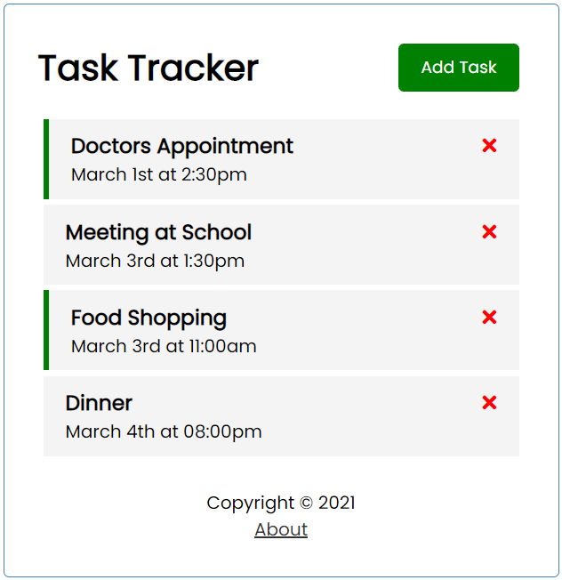

# Task Tracker

> Simple Task Tracker

## Features

- Create and Delete Task
- Turn On/Off Reminder by Double-Clicking on Specific Task
- Simple Routing (with Vue Router)
- Dummy Backend (with JSON Server)

## Technologies

- VueJS
- JSON Server

## Project Setup

### Run App

`npm run serve`

### Run Dummy Backend

`npm run dummy-backend`

### Build App

`npm run build`

### Test App

`serve dist`
